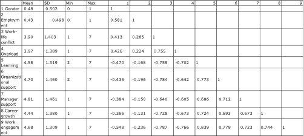
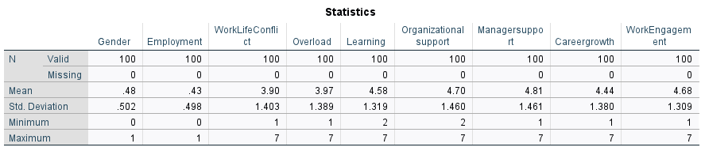
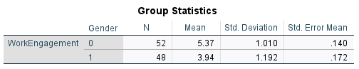
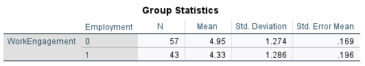
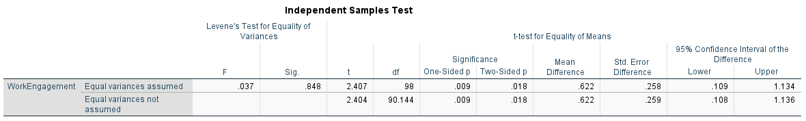
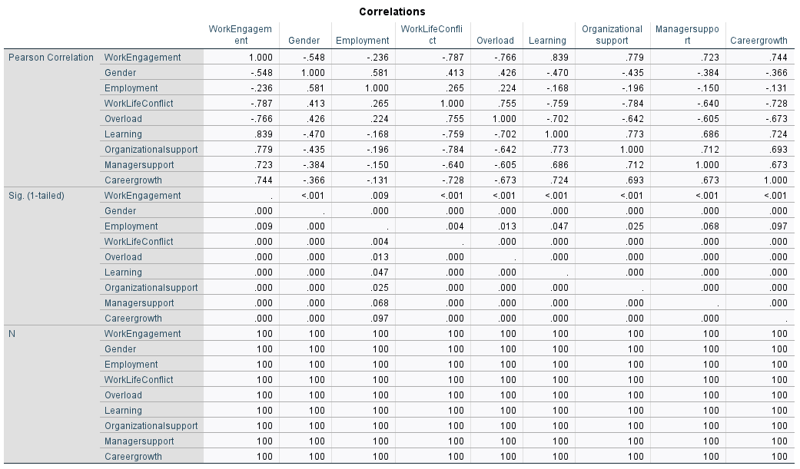
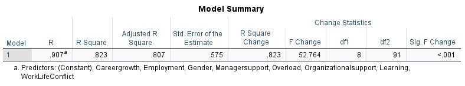
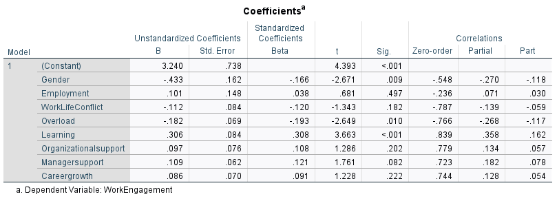

<!-- 🎯 Banner -->

  
  
  

# 💼 Employee Work Engagement Analysis Using SPSS

## 📌 Key Skills Applied

| Statistical Analysis      | HR Analytics                 | Data Tools & Visualization  |
|---------------------------|------------------------------|-----------------------------|
| t-tests                   | Engagement Predictors        | IBM SPSS                    |
| Correlation Analysis      | Gender & Work Status Studies | Inferential Statistics      |
| Multiple Regression       | Learning & Overload Factors  | Data-driven Insights        |

---

## 🧭 Project Overview

This professional HR analytics report investigates the key drivers of employee work engagement using SPSS. It examines statistical differences by gender and employment type, and identifies the most significant predictors contributing to work engagement.

**Key Research Objectives:**
1. Analyze whether employee engagement differs based on **gender** and **employment status**.
2. Identify which workplace factors—such as **learning opportunities**, **job overload**, and **support systems**—are most predictive of engagement.

**Importance:** Work engagement is central to employee retention, motivation, and organizational performance. Understanding its predictors enables HR professionals to design evidence-based interventions that boost workforce morale and productivity.

---

## 📊 Data & Methodology - <a ref="(https://github.com/ramanavbezborah/Employee-Work-Engagement/blob/main/asset/Engagement%20data%20for%20Data%20Analysis.xlsx)" download> Download Raw Data</a>

Data was gathered from 100 employees via a structured survey. Variables included engagement scores, gender, employment status (permanent vs. casual), job characteristics, and workplace factors.

**Analytical Tools:** IBM SPSS was used to perform:
- Descriptive Statistics
- Correlation Analysis
- Independent Samples t-tests
- Multiple Linear Regression

The data was preprocessed for outliers and missing values before analysis.

---

## 📈 Descriptive Statistics & Correlation

Initial descriptive analytics reveal variability in engagement across participants. A correlation matrix highlighted relationships among engagement and its predictors.

---

## ⚖️ Independent Samples t-test Analysis

### 1. Gender Differences
- **Male employees** reported significantly higher engagement.
- *t(98) = -4.22, p < .001*, r = –0.55 (moderate effect size).
- **Interpretation:** Gender inequality, lack of workplace support, and social expectations may influence female engagement.

### 2. Employment Status Differences
- **Permanent employees** had higher engagement than casuals.
- *t(98) = -2.40, p = .018*, r = –0.24 (small to moderate effect).
- **Interpretation:** Job security, benefits, and role identity foster greater connection among permanent staff.

---

## 🔢 Multiple Linear Regression Analysis

- Model: F(8,91) = 52.76, **p < .001**
- R² = **0.823** → 82.3% of variance in engagement explained

**Significant Predictors:**
- **Gender** (B = –0.433, p = 0.009): Females reported lower engagement.
- **Overload** (B = –0.182, p = 0.010): Excess workload negatively impacted engagement.
- **Learning** (B = 0.306, p < 0.001): Development opportunities were the strongest positive predictor.

---

## 📊 Visual Output Gallery

### Variable View (SPSS)

### Data View (SPSS)

### Output: Descriptive Stats

### Output: Correlation Matrix

### Output: Group Statistics

### Output: Independent Samples t-test

### Output: Regression Model Summary

### Output: Regression Coefficients

---

## ✅ Key Insights

1. **Address Gender Gaps**  
   Implement equitable opportunities, mentorship, and flexible policies to boost female engagement.

2. **Manage Work Overload**  
   Provide better time management tools and realistic task delegation.

3. **Enhance Learning & Growth**  
   Learning opportunities are the top driver of engagement—HR must prioritize employee development programs.

---

### 🧠 Expanded Key Insights & Business Impact

### 1. 📉 **Gender Disparity in Engagement**
- **Insight**: Female employees reported significantly lower engagement (*p < .001*, r = –0.55).
- **Business Impact**: Persistent gender inequality can reduce organizational morale, increase turnover, and damage employer branding.
- **Action**: Implement inclusive policies, mentoring programs, and gender-sensitive engagement tracking methods (e.g., third-person rating systems).

### 2. 🧾 **Employment Type Matters**
- **Insight**: Permanent employees showed higher engagement than casual staff (*p = .018*, r = –0.24).
- **Business Impact**: Engagement gaps can lead to inconsistent service quality and higher attrition in casual roles.
- **Action**: Offer stability pathways, recognize contributions of casual workers, and promote integration into team culture.

### 3. 🧠 **Learning Opportunities Drive Engagement**
- **Insight**: Learning was the **strongest positive predictor** (B = 0.306, *p* < .001).
- **Business Impact**: Growth-focused cultures boost retention, innovation, and internal mobility.
- **Action**: Build structured learning pathways—online modules, workshops, mentoring, job rotation, and university partnerships.

### 4. 🛑 **Overload Reduces Engagement**
- **Insight**: Workload negatively affected engagement (B = –0.182, *p* = .010).
- **Business Impact**: Overload contributes to burnout, disengagement, and lowered performance.
- **Action**: Conduct workload audits, redesign roles, and offer emotional and resource support through HR programs.

---

## 📚 References

1. Agarwal, U. A. (2014). Linking justice, trust and innovative work behaviour to work engagement. *Personnel Review*, 43(1), 41–73.
2. Albrecht, S. L. (2010). Handbook of Employee Engagement. *Edward Elgar Publishing*.
3. Bakker, A. B., & Demerouti, E. (2008). Towards a model of work engagement. *Career Development International*, 13(3), 209–223.
4. Saks, A. M. (2006). Antecedents and consequences of employee engagement. *Journal of Managerial Psychology*, 21(7), 600–619.
5. Schaufeli, W. B., & Bakker, A. B. (2004). Job demands, resources, and burnout. *Journal of Organizational Behavior*, 25(3), 293–315.
6. Shuck, B., & Wollard, K. (2010). Employee engagement and HRD. *Advances in Developing Human Resources*, 12(4), 429–446.

---

**Author:** Ramanav Bezborah  
**Tool:** IBM SPSS Statistics  
**Year:** 2025
